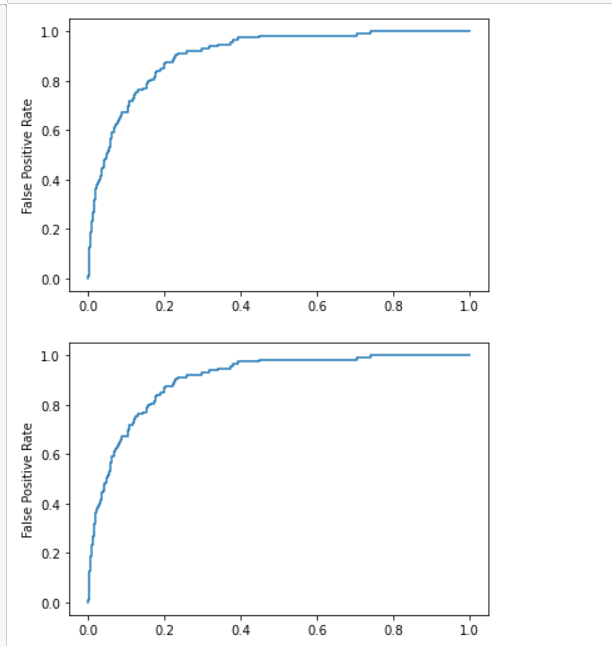

### EX NO : 07
### DATE  :
# <p align="center"> ROC CURVE PLOT </p>
## Aim:
   To write python code to plot ROC curve used in ANN.
## Equipments Required:
1. Hardware – PCs
2. Anaconda – Python 3.7 Installation / Moodle-Code Runner /Google Colab

## Related Theory Concept:

## Algorithm
1. Import Necessary Packages.
2. Load the Data.
3. Create Training and Test Samples.
4. Fit the Logistic Regression Model.
5. Diagnostics

## Program:
```

Program to plot Receiver Operating Characteristic [ROC] Curve.
Developed by   : SOUVIK KUNDU
RegisterNumber :  212221230105


import pandas as pd
import numpy as np
from sklearn.model_selection import train_test_split
from sklearn.linear_model import LogisticRegression
from sklearn import metrics
import matplotlib.pyplot as plt
url="https://raw.githubusercontent.com/Statology/Python-Guides/main/default.csv"
data=pd.read_csv(url)
x=data[['student','balance','income']]
y=data['default']
X_train,X_test,Y_train,Y_test=train_test_split(x,y,test_size=0.3,random_state=0)
log=LogisticRegression()
log.fit(X_train,Y_train)
y_pred_proba=log.predict_proba(X_test)[::,1]
fpr,lpr,_=metrics.roc_curve(Y_test,y_pred_proba)
plt.plot(fpr,lpr)
plt.ylabel("True Positive Rate")
plt.ylabel("False Positive Rate")
plt.show()
y_pred_proba=log.predict_proba(X_test)[::,1]
fpr,lpr,_=metrics.roc_curve(Y_test,y_pred_proba)
auc=metrics.roc_auc_score(Y_test,y_pred_proba)
plt.plot(fpr,lpr,label="AUC=")
plt.ylabel("True Positive Rate")
plt.ylabel("False Positive Rate")
plt.show()


```

## Output:



## Result:
Thus the python program successully plotted Receiver Operating Characteristic [ROC] Curve.
